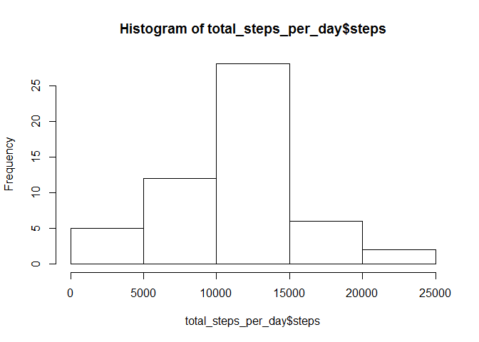
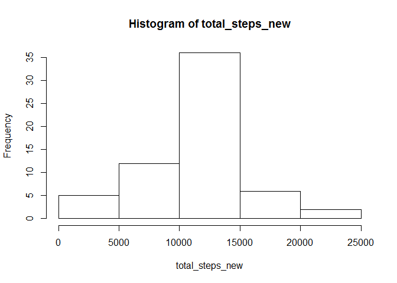
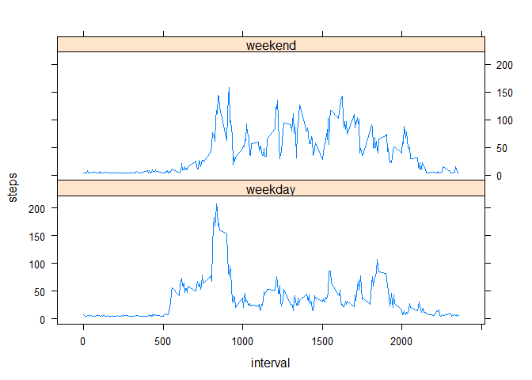

# Reproducible Research: Peer Assessment 1


## Loading and preprocessing the data


```r
unzip(zipfile="activity.zip")
data <- read.csv("activity.csv")

data$date <- as.Date(data$date,"%Y-%m-%d")
data$steps <- as.numeric(data$steps)
```


## What is mean total number of steps taken per day?

- Calculate the total steps taken per day


```r
total_steps_per_day <- aggregate(steps~date,data=data,sum,na.rm=TRUE)
```

- Create a histogram of the total number of steps taken per day


```r
hist(total_steps_per_day$steps)
```

<!-- -->

- Calculate mean and median


```r
mean(total_steps_per_day$steps)
```

```
## [1] 10766.19
```

```r
median(total_steps_per_day$steps)
```

```
## [1] 10765
```

## What is the average daily activity pattern?

- make a time series plot of the 5-minute interval and the average number of steps taken, averaged across all days


```r
steps_int<-aggregate(steps~interval,data=data,mean,na.rm=TRUE)
plot(steps~interval,data=steps_int,type="l")
```

<!-- -->

- Which 5-minute interval, on average across all the days in the dataset, contains the maximum number of steps?


```r
steps_int[which.max(steps_int$steps),]
```

```
##     interval    steps
## 104      835 206.1698
```

## Imputing missing values

- calculate the total number of missing values in the dataset


```r
missing_cnt <- sum(is.na(data$steps))
```

There are 2304 rows missing values.

- Devise a strategy for filling in all of the missing values in the dataset.

All of the missing values are filled in with mean value for the 5-minute interval.


```r
full_data <- data
full_data[is.na(full_data[,1]),1] <- mean(full_data[,1], na.rm=TRUE)
```

- Make a histogram of the total number of steps taken each day


```r
total_steps_new <- tapply(full_data$steps,full_data$date,sum)
hist(total_steps_new)
```

<!-- -->

Now calculate and report mean and median total number of steps taken per day.


```r
mean_new <- mean(total_steps_new)
mean_new
```

```
## [1] 10766.19
```


```r
median_new <- median(total_steps_new)
median_new
```

```
## [1] 10766.19
```


## Are there differences in activity patterns between weekdays and weekends?

- create a new factor variable in the dataset with two levels - "weekday" and "weekend" indicating wheter a given date is a weekday or a weekend day.


```r
full_data$day<-ifelse(as.POSIXlt(full_data$date)$wday%%6==0,
                      "weekend","weekday")
#char to factor
full_data$day<-factor(full_data$day,levels=c("weekday","weekend"))
```

- Make a panel plot containing a time series plot of the 5-minute interval and the average number of steps taken, averaged across all weekday days or weekend days.


```r
weekday_data <- full_data[full_data$day == "weekday", ]
weekend_data <- full_data[full_data$day == "weekend", ]

avgWeekday <- aggregate(steps~interval,data=weekday_data,FUN=mean)
avgWeekday$day <- "weekday"
avgWeekend <- aggregate(steps~interval,data=weekend_data,FUN=mean)
avgWeekend$day <- "weekend"

avgCombined <- rbind(avgWeekday, avgWeekend)

library(lattice)
xyplot(steps ~ interval | day, data = avgCombined, 
       type = "l", layout = c(1, 2))
```

<!-- -->


